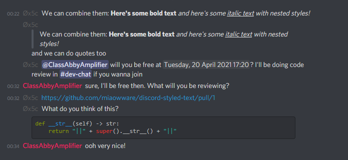

===================
discord-styled-text
===================

A small library to style text for Discord without having to remember any syntax

.. toctree::
    :hidden:

    index

Installation
============

``discord-styled-text`` requires Python 3.6 at minimum. Install by running::

    $ pip install discord-styled-text

Example Usage
=============

.. code-block:: python

    >>> from discord_styler import *

    >>> bold_text = Bold("Here's some bold text")
    >>> italic_text = Italic("and here's some", Underline("italic text"), "with nested styles!")
    >>> text = StyledText("We can combine them:", bold_text, italic_text)
    >>> str(text)
    "We can combine them: **Here's some bold text** *and here's some __italic text__ with nested styles!*"

    >>> quoted = StyledText(BlockQuote(text), "and we can do quotes too")
    >>> str(quoted)
    "> We can combine them: **Here's some bold text** *and here's some __italic text__ with nested styles!*\n and we can do quotes too"

    >>> question = StyledText(
    ...     UserMention(200102491231092736),
    ...     f"will you be free at {TimeStamp(1618953630, TimeStyle.LongDateTime)}?",
    ...     f"I'll be doing code review in {ChannelMention(656893570711814145)} if you wanna join")
    >>> str(question)
    "<@200102491231092736> will you be free at <t:1618953630:F>? I'll be doing code review in <#656893570711814145> if you wanna join"

    >>> link = NonEmbeddingURL("https://github.com/miaowware/discord-styled-text/pull/1")
    >>> str(link)
    '<https://github.com/miaowware/discord-styled-text/pull/1>'

    >>> code = StyledText(
    ...     "What do you think of this?\n",
    ...     CodeBlock('def __str__(self) -> str:\n        return "||" + super().__str__() + "||"', lang="py"))
    >>> str(code)
    'What do you think of this?\n ```py\ndef __str__(self) -> str:\n        return "||" + super().__str__() + "||"\n```'



API
===

All classes are directly stringifiable.

See the `Discord Documentation on Message Formatting`_ and `Discord Help on Markdown`_
for more information on the formatting this library abstracts.

.. _Discord Documentation on Message Formatting: https://discord.com/developers/docs/reference#message-formatting
.. _Discord Help on Markdown: https://support.discord.com/hc/en-us/articles/210298617-Markdown-Text-101-Chat-Formatting-Bold-Italic-Underline-


.. currentmodule:: discord_styler

Text Styles
-----------

.. autoclass:: StyledText()

.. autoclass:: Italic()

.. autoclass:: Bold()

.. autoclass:: Underline()

.. autoclass:: Strikethrough()

.. autoclass:: InlineCode()

.. autoclass:: Spoiler()

.. autoclass:: BlockQuote()

Code Blocks
-----------

.. autoclass:: CodeBlock()

URLs
----

.. autoclass:: TitledURL()

.. autoclass:: NonEmbeddingURL()

Mentions
--------

.. autoclass:: MentionABC()

.. autoclass:: UserMention()

.. autoclass:: RoleMention()

.. autoclass:: ChannelMention()

Timestamps
----------

.. autoclass:: TimeStamp()

.. autoenum:: TimeStyle()

License
=======

Copyright 2021 classabbyamp, 0x5c

Released under the BSD 3-Clause License. See ``LICENSE`` for the full license text.
